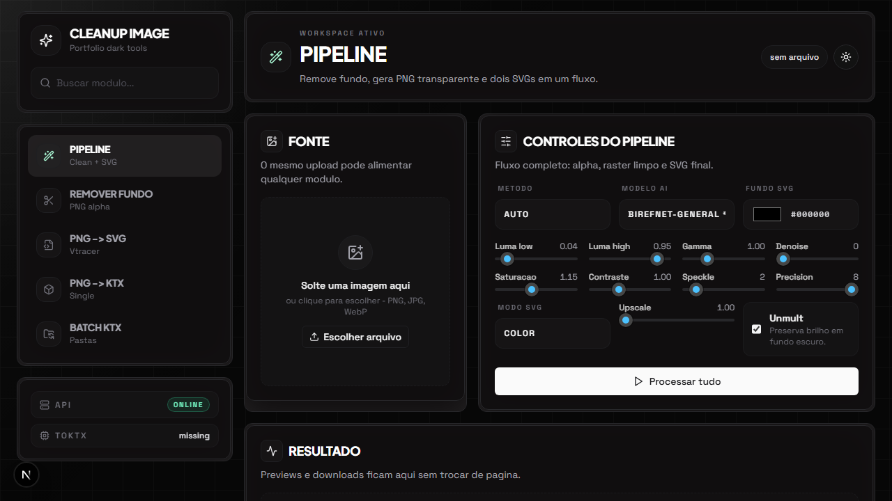

<div align="center">

# Sharpz

### A dark portfolio-style image cleanup, vectorization, and texture conversion workspace.

[](https://www.python.org)
[](https://fastapi.tiangolo.com)
[](https://nextjs.org)
[](https://react.dev)
[](https://www.typescriptlang.org)
[](https://tailwindcss.com)

Private production tool by [opZywl](https://github.com/opZywl), styled after the dark portfolio interface.

</div>

## Preview

<p align="center">
  
</p>

## What Sharpz Does

Sharpz is a local-first utility for preparing images and textures:

- Remove backgrounds with AI segmentation or luma keying.
- Preserve neon, glow, smoke, fire, and transparent edge detail.
- Export a clean transparent PNG.
- Convert raster images to SVG with both background and transparent variants.
- Convert PNG/JPG textures to KTX2 for 3D pipelines.
- Run everything from a dark web dashboard, FastAPI endpoints, Gradio, or CLI.

## Web App

Start the API:

```powershell
python -m venv venv
.\venv\Scripts\activate
pip install -r requirements.txt
python server.py
```

Start the dashboard:

```powershell
cd web
npm install
npm run dev
```

Open:

```text
http://localhost:5174
```

The web dashboard talks to FastAPI at:

```text
http://127.0.0.1:8000
```

## Workspaces

| Workspace | Purpose |
| --- | --- |
| Pipeline | Remove background and generate PNG + SVG outputs in one pass. |
| Remover Fundo | Fine control over AI, alpha matting, luma keying, color, and edge cleanup. |
| PNG -> SVG | Direct vtracer controls for color mode, hierarchy, path mode, and precision. |
| PNG -> KTX | Single-file KTX2 conversion for uploaded textures. |
| Batch KTX | Local folder batch conversion with recursive and flattened output modes. |

## API

| Endpoint | Method | Description |
| --- | --- | --- |
| `/api/health` | GET | API health check. |
| `/api/models` | GET | Available rembg models. |
| `/api/pipeline` | POST | Full image cleanup + SVG pipeline. |
| `/api/clean` | POST | Background removal only. |
| `/api/svg` | POST | Vectorization only. |
| `/api/ktx/presets` | GET | KTX preset list and `toktx` status. |
| `/api/ktx/single` | POST | Convert one uploaded image to KTX. |
| `/api/ktx/batch` | POST | Convert a local folder to KTX. |

## CLI

Full pipeline for one image:

```powershell
python cli.py graphics.png -o output/
```

Batch background cleanup:

```powershell
python cli.py samples/ -o output/ --no-svg --model u2net
```

Logo-style SVG:

```powershell
python cli.py logo.png -o output/ --color-mode binary --filter-speckle 8
```

KTX conversion:

```powershell
python ktx_cli.py texture.png -o texture.ktx --preset ultra
```

## KTX Setup

KTX conversion requires `toktx` from KTX-Software in your PATH.

- Windows: install KTX-Software from GitHub Releases and enable "Add to PATH".
- Linux: install `ktx-tools` when available.
- macOS: `brew install ktx`.

Check:

```powershell
toktx --version
```

## Project Structure

```text
sharpz/
  app.py                  # Legacy Gradio UI
  server.py               # FastAPI backend for the Next.js dashboard
  cli.py                  # Background removal + SVG CLI
  ktx_cli.py              # KTX2 CLI
  src/
    processor.py          # Core cleanup and SVG pipeline
    ktx.py                # KTX conversion engine
  web/
    app/                  # Next.js App Router dashboard
    components/           # UI primitives and upload/results components
```

## Validation

Current checks used during setup:

```powershell
python -m py_compile server.py
cd web
npm run build
```

## Usage

This repository is private and intended as a personal production utility for image cleanup, vector asset preparation, and portfolio texture workflows.
